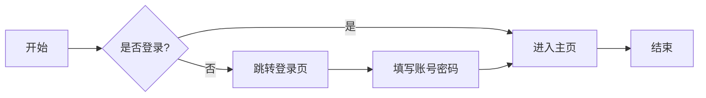
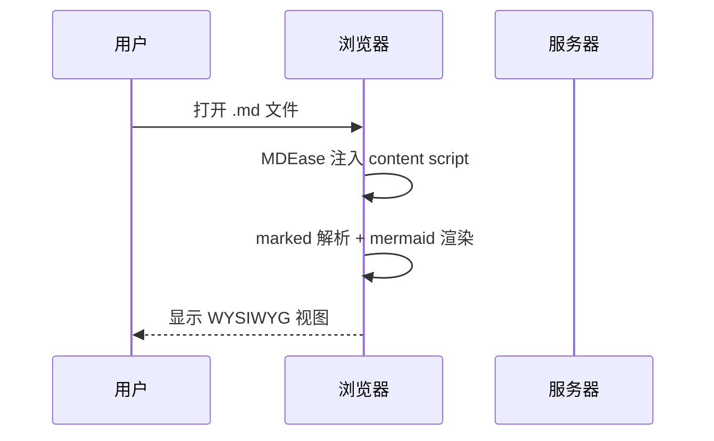
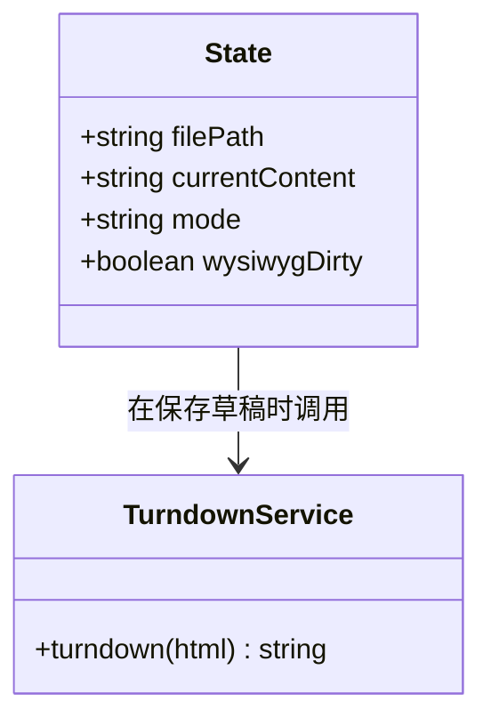

# Mermaid 测试文档

这是一个用来验证 MDEase 是否支持 mermaid 图表渲染的样例。

## 流程图



## 时序图



## 类图



## 普通代码块（不应被 mermaid 处理）

```js
const x = 1;
console.log('hello');
```

## 普通文字段落

下面是一段普通的中文，用来确认非图表内容不受影响。

- 列表项一
- 列表项二
- 列表项三
